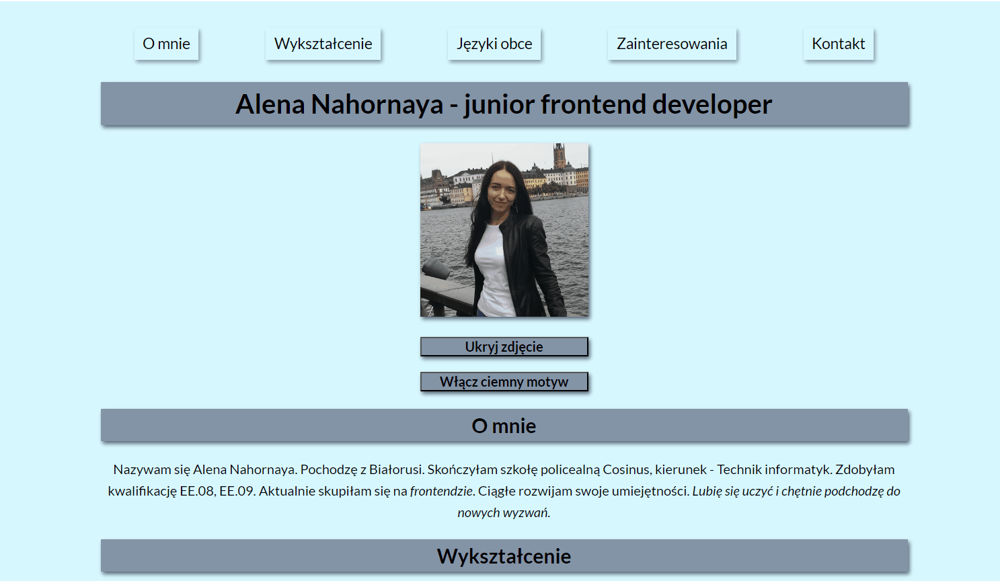

# Alena Nahornaya - homepage

## Description:

Welcome to my first webpage. It was created as a part of [YouCode](hhtps://youcode.pl) course, in order to learn and practice basic skills of HTML, CSS and JavaScript. Also you can find here some more information about me.

## Used technologies:

- Semantic HTML;
- CSS;
- BEM methodology;
- ES6 features.

## Demo version:
https://lenanag.github.io/homepage/